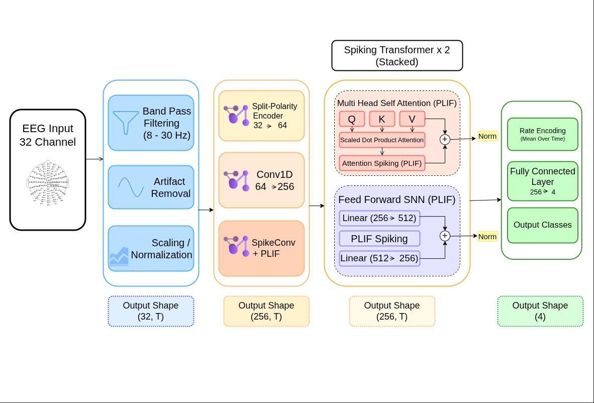
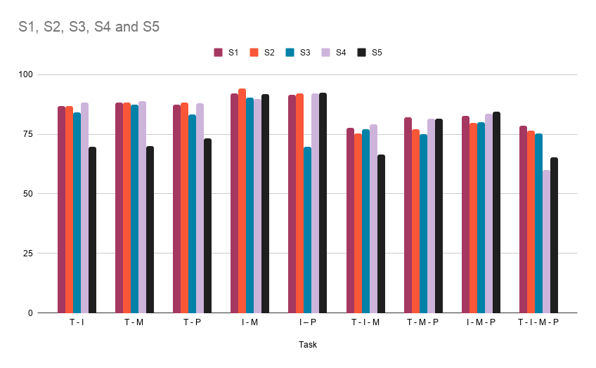
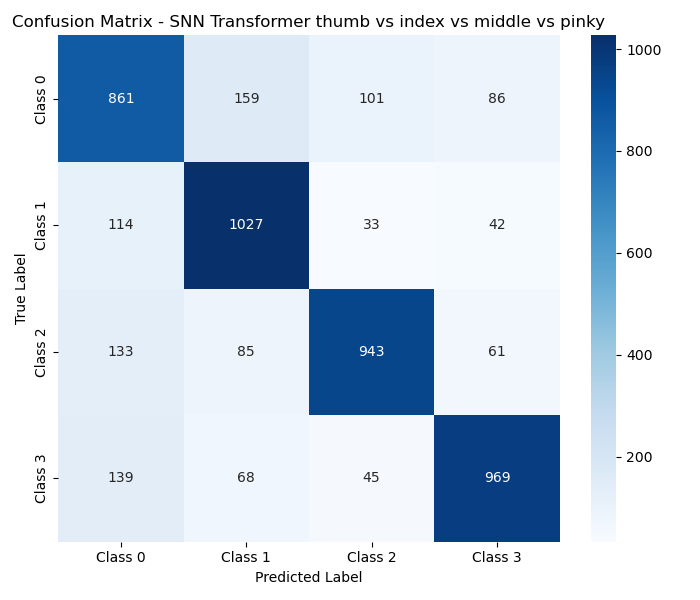

# Deep ST-PLIF

**A fully event-driven Spiking Transformer with Parametric LIF neurons for decoding fine finger movements from EEG**

[](#license)
[](#)
[](#)
[](#)

Deep ST-PLIF is a low-power, event-driven Spiking Transformer architecture for decoding individual finger movements from non-invasive scalp EEG. It targets the core bottleneck of wearable brain-computer interfaces (BCIs): deep learning models decode motor intent accurately but are too energy-hungry for battery-powered, untethered neuroprosthetics.

The architecture combines Parametric Leaky Integrate-and-Fire (PLIF) neurons with a Transformer-style attention mechanism, and introduces a biologically inspired **Split-Polarity spatial encoding** scheme that solves the "Dead Neuron" problem standard LIF neurons run into on fast-oscillating, zero-mean EEG signals.

<p align="center">
  
  <br>
  <em>Figure 1 — Deep ST-PLIF pipeline: preprocessing → Split-Polarity encoding → stacked Spiking Transformer blocks → classification head</em>
</p>

---

## Table of Contents

- [Highlights](#highlights)
- [Problem](#problem)
- [Method](#method)
  - [1. EEG Preprocessing](#1-eeg-preprocessing)
  - [2. Split-Polarity Encoding](#2-split-polarity-encoding)
  - [3. Deep ST-PLIF Architecture](#3-deep-st-plif-architecture)
  - [4. Training Setup](#4-training-setup)
- [Dataset](#dataset)
- [Results](#results)
- [Energy Efficiency](#energy-efficiency)
- [Comparison to Prior Work](#comparison-to-prior-work)
- [License](#license)

---

## Highlights

- **78.24%** accuracy on the full 4-class fine finger task (Thumb / Index / Middle / Pinky), and up to **93.97%** on anatomically adjacent binary pairs (Index vs. Middle).
- **13.87×** theoretical energy efficiency improvement over an equivalent LSTM baseline, from replacing dense Multiply-Accumulate (MAC) operations with sparse Accumulate (AC) operations.
- A novel **pre-synaptic Split-Polarity encoder** that prevents phase-cancellation in spiking neurons without discarding raw temporal phase information (unlike prior frequency-domain or spatial-filtering approaches).
- **Softmax-free spiking attention** — Query/Key similarity drives PLIF neurons directly, producing sparse binary attention maps instead of dense probability distributions.
- Demonstrated **robustness to electrode failure**: the model learns near-zero attention weights for a simulated dead channel (C15) without loss of classification accuracy.
- Fully **subject-specific** training and evaluation across 5 subjects from the CMU Motor Execution dataset, reflecting the high inter-subject variability of EEG.

## Problem

Wearable BCIs increasingly rely on deep learning (CNNs, LSTMs, Transformers) to decode motor intent from EEG with high accuracy. But these models depend on dense, synchronous MAC operations, which translate into high energy consumption, thermal overhead, and short battery life on edge/prosthetic hardware.

Spiking Neural Networks (SNNs) are a natural fit for low-power, event-driven inference — but standard unipolar Leaky Integrate-and-Fire (LIF) neurons suffer from the **"Dead Neuron" problem** when fed raw, fast-oscillating, zero-mean EEG: the positive and negative phases of the signal cancel out inside the neuron's membrane potential, silencing the neuron and freezing its weights during training.

Deep ST-PLIF is designed to close this gap — combining the representational power of attention-based Transformers with the energy profile of spiking computation, while explicitly resolving the phase-cancellation failure mode.

## Method

Figure 1 shows the three-stage pipeline: **Data Preprocessing → Spiking Transformer Design → Classification Head**.

### 1. EEG Preprocessing

Continuous EEG (128-channel BioSemi system, downselected to 32 sensorimotor channels C1–C32) is cleaned and standardized before encoding:

| Step | Detail |
|---|---|
| Line-noise removal | FIR notch filter at 60 Hz |
| Band-pass filtering | Zero-phase FIR (firwin), 4–40 Hz (isolates Mu/Alpha 8–13 Hz and Beta 13–30 Hz rhythms) |
| Downsampling | 1024 Hz → 100 Hz (zero-padded prior to resampling to limit aliasing) |
| Re-referencing | Common Average Reference (CAR) across the 32 retained channels |
| Artifact removal | ICA (10–30 components), ocular/myogenic components rejected on inspection of topography + dynamics |
| Epoching | 5 s post-stimulus window per trial; sliding window augmentation (1.0 s window, 0.125 s step, 0.0–4.0 s span) |
| Epoch-level rejection | Channel std-dev thresholded in the 20–200 µV range, retaining ≥10% of cleanest epochs |
| Class balancing | Random downsampling of the majority (Thumb) class to match minority class counts |

The CAR transform for channel *i* is:

```
V_i^CAR(t) = V_i(t) − (1/N) Σ_j V_j(t),   N = 32
```

### 2. Split-Polarity Encoding

Rather than delta-modulation (which loses information when converting continuous EEG to spikes), Deep ST-PLIF uses a biologically inspired **ON/OFF pathway split**, analogous to retinal encoding:

- A ReLU-based split turns each of the 32 sensorimotor channels into a **positive (ON)** and **negative (OFF)** channel → 64 channels total.
- Both positive spikes and negative troughs now contribute additively to membrane potential integration, instead of cancelling out.
- This preserves fine-grained temporal phase information that frequency-domain or spatial-filtering approaches used in prior spiking BCI work (e.g., SpiTranNet-LIF, S²M-Former) discard.

### 3. Deep ST-PLIF Architecture

| Stage | Detail |
|---|---|
| Input representation | Split-Polarity encoding: 32 → 64 channels |
| Spatial encoding | Pointwise 1D convolution, 64 → 256 channels; batch norm; PLIF neuron layer with **learnable** decay rate and firing threshold |
| Spiking attention | Softmax replaced entirely by PLIF neurons — scaled Q·K acts as input current, producing sparse binary attention maps; **4 heads**, 256-dim embedding (64-dim per head) |
| Feed-forward | Spiking FFN: Linear 256→512 → PLIF → Linear 512→256 |
| Residuals | Skip connections around both the spiking attention block and the spiking FFN, stabilizing training over sequences up to 100 timesteps |
| Stacking | 2 Spiking Transformer blocks |
| Output | Rate encoding (mean over time) → fully connected 256 → 4 → output classes |

### 4. Training Setup

| Hyperparameter | Value |
|---|---|
| Gradient method | Surrogate gradient descent (fast sigmoid, slope = 5) |
| Batch size | 64 |
| Max epochs | 500 |
| Optimizer | Adam, initial LR = 2 × 10⁻³ |
| LR schedule | Cosine annealing with warm restarts (T₀ = 50 epochs, T_mult = 2) |

## Dataset

This work uses the **CMU Motor Execution dataset** (Ding et al., *Nature Communications*, 2025) — 21 subjects, 128-channel BioSemi EEG, real-time robotic hand control at individual finger level. Due to the high non-stationarity and inter-subject variability of EEG, models are trained and evaluated **per-subject** (Subjects 1–5), not pooled across subjects.

- **Classes:** Thumb, Index, Middle, Pinky
- **Subject 1:** 960 Thumb samples, 192 samples each for Index/Middle/Pinky
- **Subjects 2–5:** 800 Thumb samples, 160 samples each for Index/Middle/Pinky
- Classes balanced via random downsampling of the Thumb class before training

## Results

Models were evaluated across 2-class, 3-class, and 4-class task groupings.

<p align="center">
  
  <br>
  <em>Figure 2 — Accuracy (%) by task and subject. The Index–Middle (I–M) pair consistently performs best.</em>
</p>

**Key findings:**

- **Index–Middle (I–M)** is the strongest binary pair across all 5 subjects — up to **93.97%** accuracy (Subject 2) and F1 up to **0.94**, despite Index and Middle being anatomically adjacent in the motor cortex. This suggests the PLIF neurons are exploiting temporal decay dynamics rather than relying purely on spatial separability.
- Accuracy degrades **smoothly and monotonically** from 2-class → 3-class → 4-class tasks (no abrupt class collapse), indicating stable decision boundaries rather than overfitting.
- Performance is **subject-dependent**: e.g., Subject 3 shows a notable drop on the Middle–Pinky pair (F1 = 0.68), reflecting inter-subject variability in cortical representation.
- On the full 4-class task (Subject 1), the model reaches **78.24%** accuracy with a strong diagonal confusion matrix; most confusion occurs between anatomically/kinematically adjacent fingers (e.g., Thumb ↔ Index).

<p align="center">
  
  <br>
  <em>Figure 3 — 4-class confusion matrix (Subject 1). Errors concentrate between anatomically adjacent fingers.</em>
</p>

**Robustness:** in the Pinky-movement condition, channel C15 showed a fully dead electrode signal. Rather than discarding the trial, the model was left to handle it — the multi-head spiking attention mechanism learned to down-weight the corrupted channel and route processing through healthy neighboring electrodes, with no measurable loss in classification accuracy.

## Energy Efficiency

A 2-layer LSTM baseline (hidden size 128, 32-channel input, ~100 timesteps/inference) was used as a MAC-operation reference point:

| Model | Operations / inference | Energy / inference (45 nm CMOS, 3.2 pJ/MAC) |
|---|---|---|
| LSTM baseline | 21.4 × 10⁶ MACs | 68.48 × 10⁶ pJ |
| **Deep ST-PLIF** | Sparse AC ops | **4.93 × 10⁶ pJ** |

**→ ≈13.87× theoretical energy efficiency improvement**, from replacing dense synchronous MACs with sparse, event-driven Accumulate operations — without sacrificing classification performance.

## Comparison to Prior Work

Because the CMU dataset (2025) has no prior published benchmarks, binary-classification accuracy is compared against Liao et al. (2014, *PLoS ONE*), which uses a different EEG dataset — so this is a comparison of **overall performance ranges**, not a controlled head-to-head:

| Pair | This work (avg, S1–S5) | Liao et al. (avg, SA–SE) |
|---|---|---|
| Thumb–Index | 82.83% | 68.24% |
| Thumb–Middle | 84.34% | 72.04% |
| Thumb–Pinky | 83.71% | 78.77% |
| Index–Middle | **91.41%** | 75.07% |
| Index–Pinky | 87.25% | 84.29% |

Deep ST-PLIF's accuracies cluster in the 85–94% range, versus roughly 65–80% in the reference work.


## License

MIT
